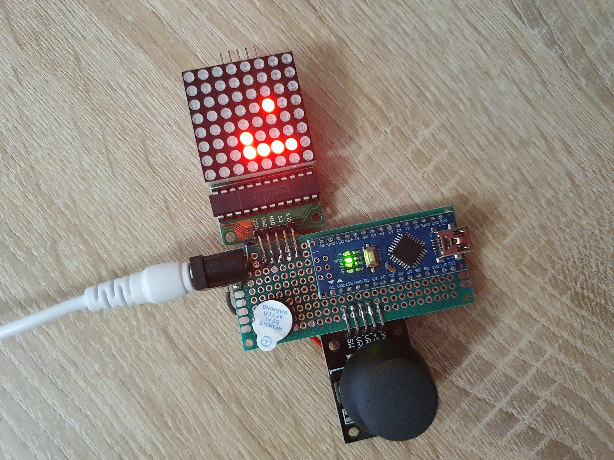
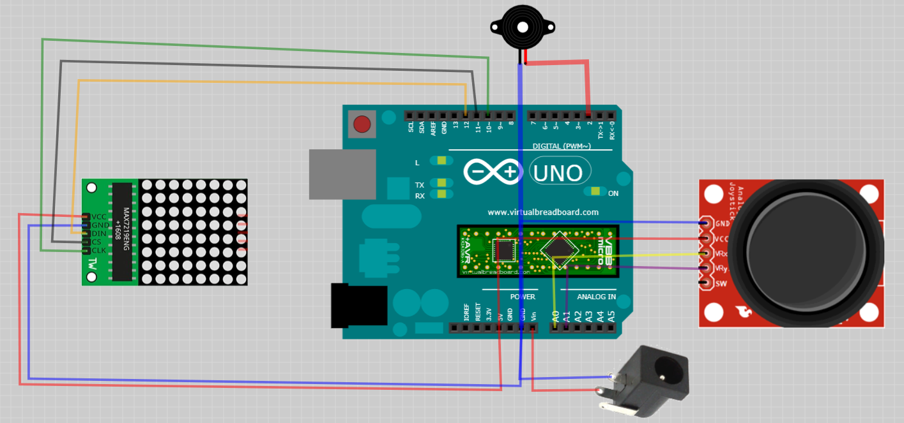

# Arduino Snake Game

Implementation of a snake game https://en.wikipedia.org/wiki/Snake_(video_game_genre) on Arduino using 8x8 LED matrix.
The next aspects of the game are customizeable via constants in the code:
* start size of the snake
* maximal size of the snake
* amount of food
* food refill strategy
Default mode is: inital length - 2, maximal length - 12, num food - 2, refill immediately.

### Equipment
* Arduino Nano Atmega328P - x1
* KY-023 Joystick Module - x1
* MAX7219 LED Matrix 8x8 - x1
* Active Buzzer 5v - x1
* Perfboard 7x3cm (24x10 holes + 2x8 side connectors) - x1
* Wires - x15
* 9V/1A DC Power supply (DC-005 male plug) - x1
* DC-005 feemale plug - x1
* Soldering set (iron, solder, flux, e.t.c.) - x1
* USB Cable - x1

⚠️⚠️⚠️ If you use a non-original Arduino Nano based on CH340/CH341 USB chip, you need to dowload drivers from http://www.wch.cn/download/CH341SER_EXE.html, otherwise Arduino studio does not recongnize the board.

⚠️⚠️⚠️ If you put buzzer like it is stated on the diagram it will be too loud. You take a resistor to decrease volume or simply do not remove the tape =)

⚠️⚠️⚠️ Joystick module could be adjusted with two potentiometers located on the joystick board. However as we only detect direction of movement and have a threshold to skip too small deviations, this is not necessary.

### Circuit Diagram

### Tools
* Arduino Studio 1.8.14

### Optional
* Virtual Breadboard 1.5.0 - to open and modify the circuit diagram

### Flash
* Connect the microcontroller via USB
* Open src/arduino-snake-game/arduino-snake-game.ino in Arduino Studio
* Go to Sketch -> Include Library -> Use ZIP Library...
* Select src/LedControl.zip library
* Compile and flash the sketch
